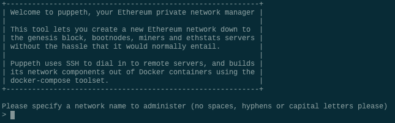
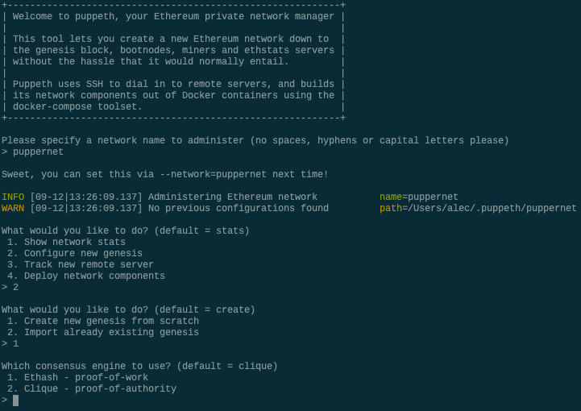
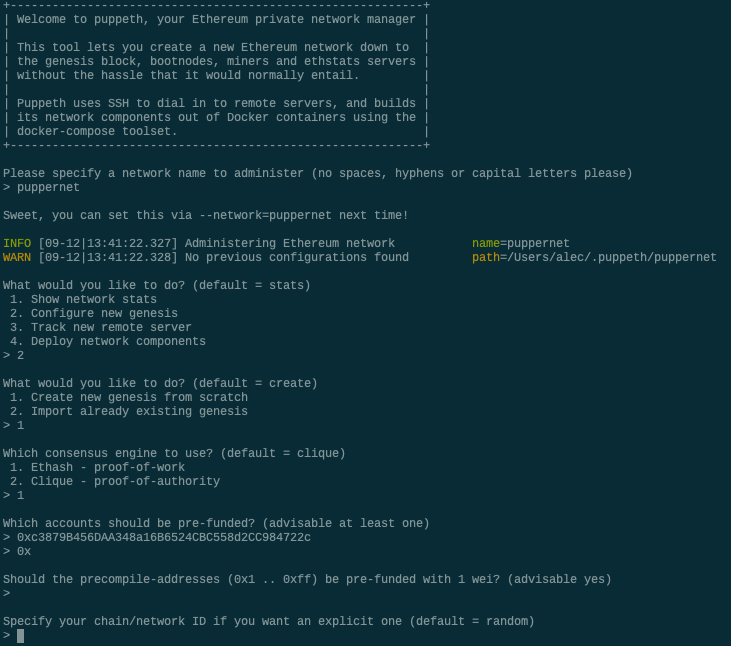
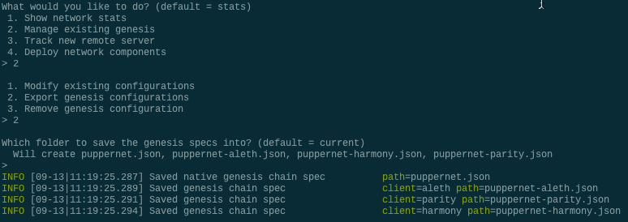

# Creating a Genesis Block

This guide will walk you through the process of creating a genesis block from scratch using `puppeth`, a tool bundled with the Go Ethereum tool.

The genesis block is the first step towards creating any new blockchain as it contains the rules for that blockchain.

If you have not yet installed the Go Ethereum tool, or you have any issues, please refer to the [Installation Guide](https://github.com/Santiago-Pedemonte/Private-Blockchains/blob/main/References/Installation%20Guides.md) for help.

Recall that **terminal window** refers to the `Terminal` in Mac, or `Git Bash` in Windows.

## Instructions

* Open a terminal window, navigate to the `Geth` folder and type the following command:

 ```bash
 ./puppeth
 ```

* This should show the following prompt:

 

* Type in a name for your network, like "puppernet" and hit enter to move forward in the wizard.

* Type `2` to pick the `Configure new genesis` option, then `1` to `Create new genesis from scratch`:

 

Now you have the option to pick a consensus engine (algorithm) to use.

* Type `1` to choose `Proof of Work`.
* Type `2` to choose `Proof of Authority`.

You will be asked to enter a pre-fund account. Note: It is recommended that you pre-fund at least one account if you'll be working with a PoA Blockchain.

* Copy and paste the **public** address from any Ethereum wallet in MyCrypto, without the `0x` prefix.

* Once you paste an address and hit enter, hit enter again on the blank `0x` address to continue the prompt.

* Continue with the default option for the prompt that asks `Should the precompile-addresses (0x1 .. 0xff) be pre-funded with 1 wei?` by hitting enter again,
 until you reach the `Chain ID` prompt.

 

* Come up with a number to use as a chain ID (e.g. `333`) type it, then hit enter.

You should see a success message and redirected to the original prompt:


Awesome! Your genesis configuration is stored in your local home directory.

## Exporting new Genesis Block

First, export your genesis configuration into a `yournetworkname.json` file as follows:

* In the `puppeth` prompt, navigate to the `Manage existing genesis` by typing `2` and hitting enter.

* You may have to type your network name again first if you're launching `puppeth` fresh.

* Then, type `2` again to choose the `Export genesis configurations` option, and continue with the default (current) directory by hitting enter:

 

* This will export several `yournetworkname.json` files -- you only need the first one without `aleth`, `parity`, or `harmony` suffixes.
* Exit `puppeth` by using the `Ctrl+C` keys combination.
