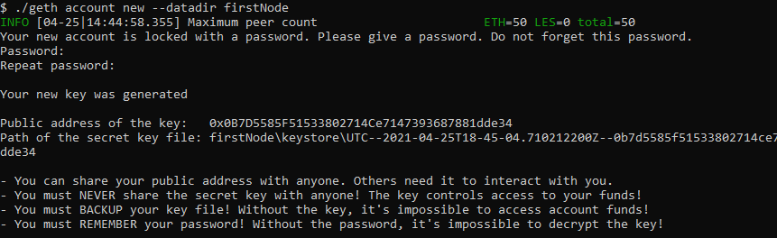
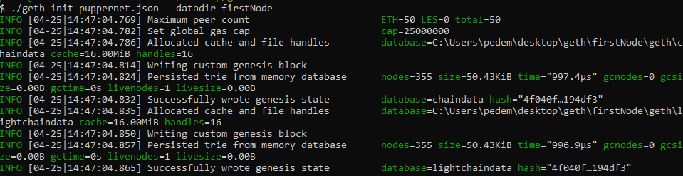

# Creation and Initialization of Nodes Guide

## Creation

Create the first node's data directory using the `geth` command and a couple of command line flags by running the following line in your terminal window (Git Bash in Windows):

 ```bash
 ./geth account new --datadir firstNode
 ```

* You will be asked to set a password for the node. This is the same password as the one needed to unlock the account from both the terminal and the [MyCrypto](https://mycrypto.com/) desktop app.

You should see a success message similar to this one:



* Make sure to save the public address for the node.

Repeat the same process for the second node:

 ```bash
 ./geth account new --datadir secondNode
 ```

* Make sure to keep track of the node's addresses and which belongs to which. You can always fetch the address later by printing the keystore file in the node's folder like so:

  ```bash
  cat firstNode/keystore/UTC--2021-04-22T20-14-04.346928000Z--959a2bd5da6097bab0c2d98e14ebfa65bed06b1b
  ```

This will output the address and other relevant information about the node contained in the Keystore file.

## Initialization

Now, it's time to initialize the nodes in the network that has been created. For a guide on creating a genesis block please refer to [this guide](https://github.com/Santiago-Pedemonte/Private-Blockchains/blob/main/References/Creating%20a%20Genesis%20Block%20in%20Geth.md).

* Initialize the first node, replacing `yournetworkname.json` with your own network's name:

 ```bash
 ./geth init yournetworkname.json --datadir firstNode
 ```

You should see this success message:



* You only need to intialize the nodes once so this process does not need to be repeated for the blockchain examples available in the repository.

* Run the same command for `secondNode`.

 ```bash
 ./geth init yournetworkname.json --datadir secondNode
 ```

Both of the nodes will now have all the information needed to start working in the network.
